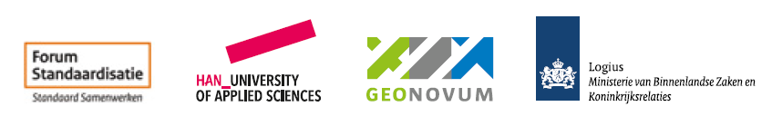

# BOMOS-Community

We hebben een online gemeenschap rond BOMOS (Beheer en OntwikkelModel voor Open Standaarden) waarin iedereen mee mag doen. Het maakt niet uit of u bij de overheid werkt, voor een bedrijf of bijvoorbeeld het onderwijs. Deelname is vrijblijvend en makkelijk te regelen. U kunt meepraten over BOMOS, vragen stellen en suggesties doen. Dergelijke vragen en suggesties worden door Logius verzameld en voorgelegd aan de klankbordgroep;
(Zie ook [BOMOS Wie doet wat](https://www.logius.nl/domeinen/infrastructuur/bomos/wie-doet-wat) )

Aanmelden voor de Community kan via mail _bomos(@)logius.nl_ 
Vragen en onderwerpen kunnen ook in de github omgeving van de community worden ingediend en hier online met elkaar worden besproken : [BOMOS-Community](https://github.com/Logius-standaarden/BOMOS-Community) 

## Events

Voor de BOMOS Comunity worden regelmatig events georganiseerd om kennis te delen en het BOMOS model door te ontwikkelen.

### 5 maart 2025 Beheerders Bijeenkomst Open Standaarden
Op 5 maart 2025, organiseren Logius, Geonovum, Forum Standaardisatie en de HAN een BOMOS sessie voor iedereen die werkt aan of belangstelling heeft voor het ontwikkelen en beheren van open standaarden. De sessie vindt plaats van 10.00-12.00 uur in Beeld en Geluid in Hilversum.
Aanmelden hiervoor kan via [Aanmelden BOMOS Event](https://www.geonovum.nl/over-geonovum/agenda/community-meeting-beheer-en-ontwikkeling-standaarden)

__Programma__
| Tijd | Onderwerp | Spreker |
|------|-----------|---------|
| 10:00 – 10:20  | Welkom & Update BOMOS  | Désirée Castillo Gosker (Forum Standaardisatie) en   Erwin Folmer (HAN University of Applied Sciences & Kadaster) |
| 10:20 – 11:00  | Het financieel model van de AQUO standaard | Stephany de Maaijer (Informatiehuis Water) | 
| 11:00 – 11:40 | BOMOS & AI | Wouter van de Berg (TNO) |
| 11:40 – 12:00 | Rondvraag  | Allen |

### Eerdere Bijeenkomsten
|Datum | Tijd| Locatie | Onderwerpen |
|-----------------| -------|----|-----|
| 15 oktober 2024| 10:00-12:00 | Dag van de Interoperabiliteit   Meetup Jaarbeurs Utrecht | - Leveranciers & Standaarden   - Geonovum & BOMOS   - Nieuwe versie BOMOS  |

