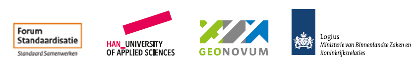

# BOMOS-Community

We hebben een online gemeenschap rond BOMOS (Beheer en OntwikkelModel voor Open Standaarden) waarin iedereen mee mag doen. Het maakt niet uit of u bij de overheid werkt, voor een bedrijf of bijvoorbeeld het onderwijs. Deelname is vrijblijvend en makkelijk te regelen. U kunt meepraten over BOMOS, vragen stellen en suggesties doen. Dergelijke vragen en suggesties worden door Logius verzameld en voorgelegd aan de klankbordgroep;
(Zie ook [BOMOS Wie doet wat](https://www.logius.nl/domeinen/infrastructuur/bomos/wie-doet-wat) )

Aanmelden voor de Community kan via mail _bomos(@)logius.nl_ 
Vragen en onderwerpen kunnen ook in de github omgeving van de community worden ingediend en hier online met elkaar worden besproken : [BOMOS-Community](https://github.com/Logius-standaarden/BOMOS-Community) 

## Events

Voor de BOMOS Comunity worden regelmatig events georganiseerd om kennis te delen en het BOMOS model door te ontwikkelen.

### 21 september 2026 Beheerders Bijeenkomst Open Standaarden 

Op 21 september organiseren HAN, Logius, Forum Standaardisatie en Geonovum weer een BOMOS meetup. Deze keer in Hilversum. We nodigen je daar van harte voor uit. 
In deze ontbijtsessie van 9.00 tot 10.00 uur nemen Erwin Folmer (HAN, Kadaster) en Wouter van den Berg (TNO) je graag mee in:

__BOMOS, standaarden en de rol van AI__

Hoe blijven standaarden relevant in een wereld waarin AI steeds sneller terrein wint? 
Erwin en Wouter duiken deze sessie in de kansen en vragen die AI oproept voor het ontwikkelen en beheren van standaarden. Vanuit BOMOS verkennen we samen hoe standaarden richting geven aan betrouwbare AI — en hoe AI op zijn beurt kan helpen om standaarden slimmer, toegankelijker en toekomstbestendiger te maken. Met praktijkvoorbeelden en ruimte voor gesprek maak je met deze sessie een inspirerende start van de dag.

De ontbijtsessie vindt plaats op dezelfde locatie als waar Forum Standaardisatie haar 20 jarig jubileum viert. Je kunt dus èn deze ontbijtsessie bezoeken èn aansluitend ook nog naar het Forum Standaardisatiecongres. Meld je daarvoor wel even apart aan. 

[Aanmelden voor de ontbijtsessie](https://fd10.formdesk.com/geonovum/bomos-meetup)

### Eerdere Bijeenkomsten
|Datum | Tijd| Locatie | Onderwerpen |
|-----------------| -------|----|-----|
| 14 oktober 2025 | 09:00-12:00 | Dag van de Interoperabiliteit   Driebergen | - Financiering en Gebruik van Standaarden  |
| 5 maart 2025| 10:00-12:00 | Instituut Beeld & Geluid - Hilversum |- BOMOS update / stand van zaken (HAN) [presentatie](https://github.com/Logius-standaarden/BOMOS-Community/blob/main/20250305/202503_HAN_BOMOS-web.pdf) - Financieel model AQUO standaard (Informatiehuis Water) [presentatie](https://github.com/Logius-standaarden/BOMOS-Community/blob/main/20250305/Financiering%20van%20open%20standaarden%20casus%20Aquo.pdf)    - BOMOS & AI (TNO)   [presentatie](https://github.com/Logius-standaarden/BOMOS-Community/blob/main/20250305/20250305%20BOMOS%20%26%20AI%20-%20mentimeter%20presentation.pdf)     |
| 15 oktober 2024| 10:00-12:00 | Dag van de Interoperabiliteit   Meetup Jaarbeurs Utrecht | - Leveranciers & Standaarden   - Geonovum & BOMOS   - Nieuwe versie BOMOS  |

